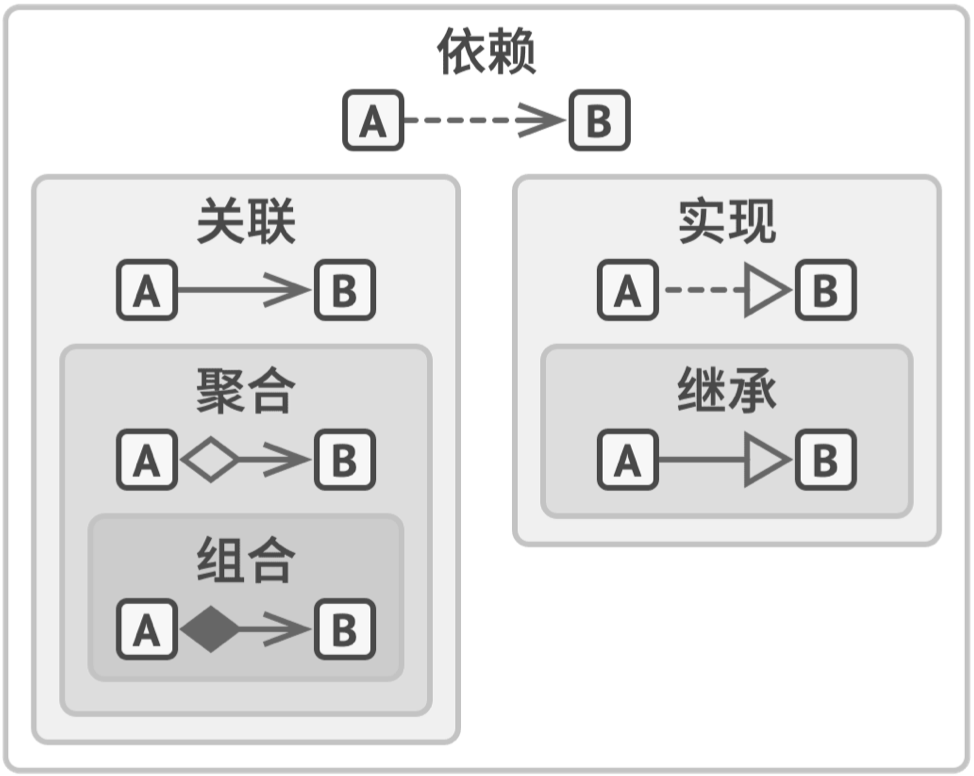

<h1 align="center">Head-First-Design-Patterns</h1>

<p align="center">
  <a href="http://codemx.cn">
  </a>
</p>

>Head First 设计模式总结

## 设计模式分类

|类型|中文名称|英文名称|
|:---:|---|---|
|创建型模式|[工厂方法模式](md/Factory.md)<br>[抽象工厂模式](md/AbstractFactory.md)<br>[简单工厂模式](md/SimpleFactory.md)<br>[单例模式](md/Singleton.md)<br>[建造者模式](md/Builder.md)<br>[原型模式](md/Prototype.md)|Factory Method<br>Abstract Factory<br>Simple Factory<br>Singleton<br>Builder<br>Prototype|
|结构型模式|[适配器模式](md/Adapter.md)<br>[装饰者模式](md/Decorator.md)<br>[代理模式](md/Proxy.md)<br>[外观模式](md/Facade.md)<br>[桥接模式](md/Bridge.md)<br>[组合模式](md/Composite.md)<br>[享元模式](md/Flyweight.md)|Adapter<br>Decorator<br>Proxy<br>Facade<br>Bridge<br>Composite<br>Flyweight|
|行为型模式|[策略模式](md/Strategy.md)<br>[模板方法模式](md/TemplateMethed.md)<br>[观察者模式](md/Observer.md)<br>[迭代器模式](md/Iterator.md)<br>[责任链模式](md/ChainOfResponsibility.md)<br>[命令模式](md/Command.md)<br>[备忘录模式](md/Memento.md)<br>[状态模式](md/State.md)<br>[访问者模式](md/Visitor.md)<br>[中介者模式](md/Mediator.md)<br>[解释器模式](md/Interpreter.md)|Strategy<br>Template Methed<br>Observer<br>Iterator<br>Chain Of Responsibility<br>Command<br>Memento<br>State<br>Visitor<br>Mediator<br>Interpreter|

* **创建型模式**：提供创建对象的机制，增加已有代码的灵活性和可复用性。
* **结构型模式**：介绍如何将对象和类组装成较大的结构，并同时保持结构的灵活和高效。
* **行为模式**：负责对象间的高效沟通和职责委派。

## 六大设计原则

* 单一职责原则：就一个类而言，应该仅有一个引起它变化的原因
* 开闭原则：软件中的对象（类、模块、函数等）应该对于扩展是开放的，但是对于修改是封闭的
* 里氏替换原则：所有引用基类的地方必须能透明地使用其子类的对象。（核心：抽象）
* 依赖倒置原则
   * 高模块不应该依赖低模块，两者都应该依赖抽象
   * 抽象不应该依赖细节
   * 细节应该依赖抽象
* 接口隔离原则：客户端不应该依赖它不需要的接口（类间的依赖关系应该建立在最小的接口上）
* 迪米特原则：一个对象应该对其他对象有最少的了解

## Head First设计原则

* 找出应用中可能需要变化之处，把它们独立出来进行封装，不要和那些不需要变化的代码混在一起，以便以后可以轻易的改动或者扩充此部分，而不影响不需要变化的部分。
* 针对接口（抽象类或者接口）编程，而不是针对实现编程。（接口代表每个行为，而行为的每个实现都将实现其中的一个接口）--多态
* 多用组合，少用继承。
* 为了交互对象之间的松耦合设计而努力。
* 对扩展开放，对修改关闭--开闭原则

## 面向对象三大特征

* 封装：隐藏对象的属性和实现细节，仅对外公开访问方法，控制在程序中属性的读和写的访问级别。

   * 目的：增强安全性和简化编程，使用者不必了解具体的实现细节，而只要通过对外公开的访问方法，来使用类的成员。
   * 要求：
      * 把所有的属性私有化。
      * 对每个属性提供 `getter` 和 `setter` 方法。
      * 如果有一个带参的构造函数的话，那一定要写一个不带参的构造函数。
      * 建议重写 `toString` 方法，但这不是必须的。
   * 优点：
      * 良好的封装能够减少耦合。
      * 类内部的结构可以自由修改。
      * 可以对成员进行更精确的控制。
      * 隐藏信息，实现细节。

* 继承：可以理解为，在一个现有类的基础之上，增加新的方法或**重写**已有方法，从而产生一个新类。

   * 权限：

      * 子类不能继承父类中访问权限为 `private` 的成员变量和方法，也不能继承父类的构造方法。子类可以重写父类的方法，及命名与父类同名的成员变量。

      * 有时候我们会有这样的需求：我们需要将某些事物尽可能地对这个世界隐藏，但是仍然允许子类的成员来访问它们。这个时候就需要使用到 `protected`。

      * 类成员访问修饰符与访问能力之间的关系：

         |       类型       | private  |  无修饰  | protected | public |
         | :--------------: | :------: | :------: | :-------: | :----: |
         |      同一类      |  可访问  |  可访问  |  可访问   | 可访问 |
         |  同一包中的子类  | 不可访问 |  可访问  |  可访问   | 可访问 |
         | 同一包中的非子类 | 不可访问 |  可访问  |  可访问   | 可访问 |
         |  不同包中的子类  | 不可访问 | 不可访问 |  可访问   | 可访问 |
         | 不同包中的非子类 | 不可访问 | 不可访问 | 不可访问  | 可访问 |

   * 普通类、抽象类、接口继承规律：

      * 普通类可以继承（`extends`）普通类，可以继承（`extends`）抽象类，可以继承（`implements`）接口。
      * 抽象类可以继承（`extends`）普通类，可以继承（`extends`）抽象类，可以继承（`implements`）接口。
      * 接口只能继承（`extends`）接口。

   * 继承规律中的约束：

      * 一个普通类或一个抽象类，要么继承**一个**普通类，要么继承**一个**抽象类，即所谓的**单继承**。
      * 一个普通类或一个抽象类或一个接口，可以继承**任意多个**接口。
      * 一个普通类继承一个抽象类后，必须实现这个抽象类中定义的所有抽象（`abstract`）方法，否则就只能被定义为抽象类。
      * 一个普通类继承一个接口后，必须实现这个接口中定义的所有方法，否则就只能被定义为抽象类。
      * 抽象类继承抽象类，或者实现接口时，可以部分、全部或者完全**不实现**父类抽象类的抽象（`abstract`）方法或父类接口中定义的方法。

   * 优点：

      * 代码重用，减少创建类的成本，每个子类都拥有父类的方法和属性。
      * 子类和父类基本相似，但又与父类有所区别。
      * 提高代码的可扩展性。

   * 缺点：

      * 继承是侵入性的，只要继承就必须拥有父类的所有属性和方法。
      * 可能造成子类代码冗余，灵活性降低，因为子类必须拥有父类的属性和方法。


* 多态：相同的事物，调用其相同的方法，参数也相同时，但表现的行为却不同。
   * 三个必要条件：
      * 继承：在多态中必须存在有继承关系的子类和父类。
      * 重写：子类对父类中某些方法进行重新定义，在调用这些方法时就会调用子类的方法。
      * 向上转型：在多态中需要将子类的引用赋给父类对象，只有这样该引用才能够具备技能调用父类的方法和子类的方法。
   * 实现方式：
      * 基于继承实现的多态: 主要表现在父类和继承该父类的一个或多个子类对某些方法的重写，多个子类对同一方法的重写可以表现出不同的行为。
      * 基于接口实现的多态: 在接口的多态中，指向接口的引用必须是指定这实现了该接口的一个类的实例，在运行时，根据对象引用的实际类型来执行对应的方法。
      * 继承都是**单继承**，只能为一组相关的类提供一致的服务接口。
      * 接口是**多继承多实现**，它能够利用一组相关或者不相关的接口进行组合与扩充，能够对外提供一致的服务接口。所以它相对于继承来说有更好的灵活性。

## 重写和重构

* 重写（overriding）: 指在**继承**情况下，子类中定义了与其父类中方法具有相同型构的新方法，就称为子类把父类的方法重写了。这是实现多态必须的步骤。
* 重载（overloading）: 指在**同一个类**中定义了一个以上具有相同名称，但是型构不同的方法。

## 接口与抽象类的区别

* 不同点：
   * 接口可以多实现，而抽象类只能单继承
   * 抽象类可以有非抽象的方法和构造方法、变量，但是接口只能有抽象方法，静态常量。
   * 抽象类和子类具有父子关系，子类能拥有父类中一些属性。接口虽然某个类实现一个接口，但是由于接口中的变量都为静态常量，不存在继承关系。

* 相同点：
   * 无论接口还是抽象类，都无法直接实例化，其自身实例化需要靠实现类或子类来实现。
   * 接口和抽象类都必须实现其中的所有方法。

## UML图谱



## ComputeHeatIndex

```java
private float computeHeatIndex(float t, float rh) {
	float index = (float)((16.923 + (0.185212 * t) + (5.37941 * rh) - (0.100254 * t * rh) +
		(0.00941695 * (t * t)) + (0.00728898 * (rh * rh)) +
		(0.000345372 * (t * t * rh)) - (0.000814971 * (t * rh * rh)) +
		(0.0000102102 * (t * t * rh * rh)) - (0.000038646 * (t * t * t)) + (0.0000291583 *  
		(rh * rh * rh)) + (0.00000142721 * (t * t * t * rh)) +
		(0.000000197483 * (t * rh * rh * rh)) - (0.0000000218429 * (t * t * t * rh * rh)) +     
		0.000000000843296 * (t * t * rh * rh * rh)) -
		(0.0000000000481975 * (t * t * t * rh * rh * rh)));
	return index;
}
```

## 参考资料

* [二十三种设计模式Github](https://github.com/Shimingli/AndriodDesignPattern)
* [图说设计模式](https://design-patterns.readthedocs.io/zh_CN/latest/index.html)
* [深入理解设计模式](https://refactoringguru.cn/design-patterns)：多语言支持，多编程语言支持
* [Head First 设计模式源码整理](https://github.com/yuchuangu85/Head-First-Design-Patterns)：自己整理
* [二十三种设计模式](https://www.jianshu.com/p/4e01479b6a2c)：图文搭配讲解
* [AndriodDesignPattern 安卓的23种设计模式](https://github.com/Shimingli/AndriodDesignPattern)：图文代码综合讲解
* [图说设计模式](https://design-patterns.readthedocs.io/zh_CN/latest/index.html)：C#语言的设计模式
* [Java设计模式：23种设计模式全面解析（超级详细）](http://c.biancheng.net/design_pattern/)：概述讲解设计模式
* [java-design-patterns](https://github.com/iluwatar/java-design-patterns)：Java设计模式代码
* [java-design-patterns源码对应网站](https://java-design-patterns.com/patterns/)
* [java-design-patterns-example-tutorial](https://www.journaldev.com/1827/java-design-patterns-example-tutorial): Java Design Patterns tutorial Wibsite.
* [AndriodDesignPattern](https://github.com/Shimingli/AndriodDesignPattern)：二十三种设计模式（每个模式完成了一个小Demo）
* 《Head First Design Patterns》
* 《Android源码设计模式解析与实战》
* 《深入设计模式》
* 《设计模式：可复用面向对象软件的基础》
* 《图解设计模式》
* 《设计模式之禅》
* [java 面向对象三大特性（封装，继承，多态）以及抽象、接口的介绍](https://blog.csdn.net/qq_22118507/article/details/51422591)

