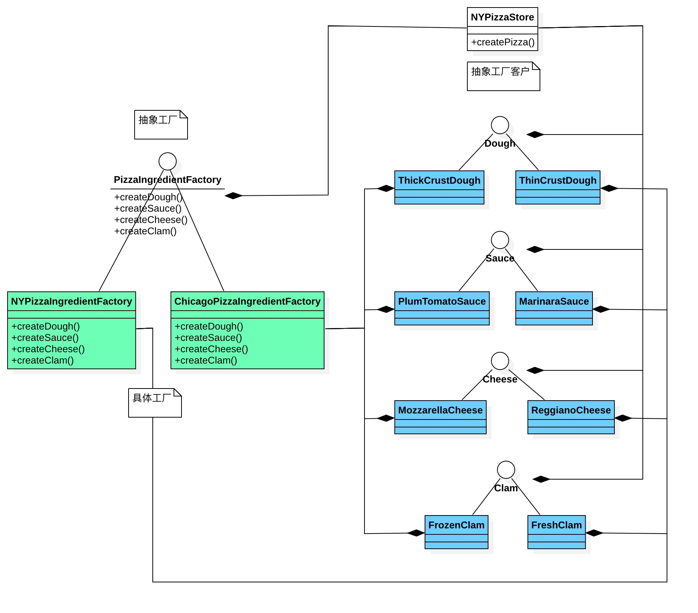

<h1 align="center">抽象工厂模式（AbstractFactory）</h1>

## 定义：
提供一个接口，用于创建相关或依赖对象的家族，而不需要明确指定具体的类。

## UML图



## 抽象工厂方法组成及条件

```
abstract Product factoryMethod(String type);
```
- 方法是抽象的，所以依赖子类来处理对象的创建
- 工厂方法必须返回一个产品。超类中定义的方法，通常使用到工厂方法的返回值。
- 工厂方法将客户（也就是超类中的代码，和实际创建具体产品的代码分隔开）
- 工厂方法可能需要参数（也可能不需要）来指定所需要的产品


## 优点:
- 抽象工厂模式隔离了具体类的生成，使得客户并不需要知道什么被创建。由于这种隔离，更换一个具体工厂就变得相对容易。所有的具体工厂都实现了抽象工厂汇总定义的那些公共接口，因此只需改变具体工厂的实例，就可以在某种程度上改变整个软件系统的行为。另外，应用抽象工厂模式可以实现高内聚低耦合的设计目的，因此抽象工厂模式得到了广泛的应用。
- 当一个产品族中的多个对象被设计成一起工作时，它能够保证客户端始终只使用同一个产品族中的对象。这对一些需要根据当前环境来决定其行为的软件系统来说，是一种非常实用的设计模式。
- 增加新的具体工厂和产品族非常方便，无需修改已有系统，符合“开闭原则”。

## 缺点:
- 在添加新产品对象时，难以扩展抽象工厂来生成新种类的产品，这是因为抽象工厂角色中规定了所有可能被创建的产品结合，要支持新种类的产品就意味着要对该接口进行扩展，而这将玩涉及到对抽象工厂角色及其所有子类的修改，显然会带来较大的不便。
- 开闭原则的倾斜性（增加新的工厂和产品族容易，增加薪的产品等级结构麻烦）。

## 适用环境：
- 一个系统不应当依赖于产品类实例如何被创建、组合和表达的细节，这对于所有类型的工厂模式都是重要的。
- 系统中有多于一个的产品族，而每次只使用其中一个产品族。
- 属于同一个产品族的产品将在一起使用，这一约束必须在系统的设计中体现出来。
- 系统提供一个产品类的库，所有的产品以相同的接口出现，从而使客户端不依赖于具体实现。