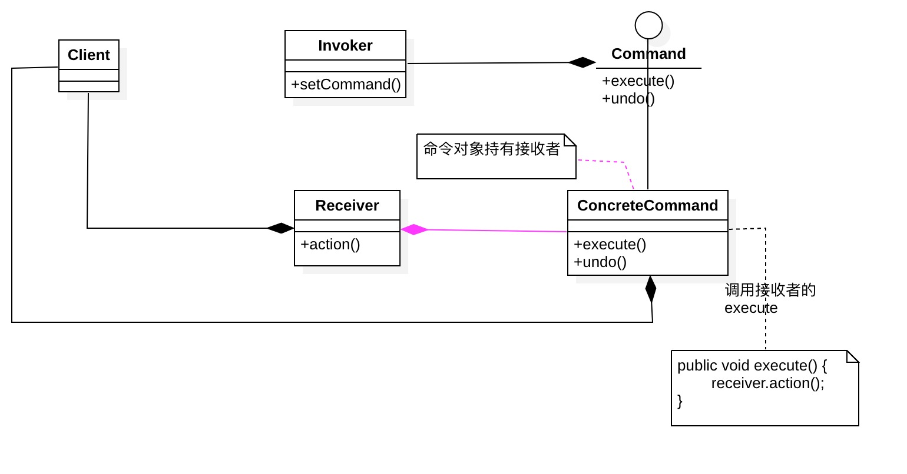
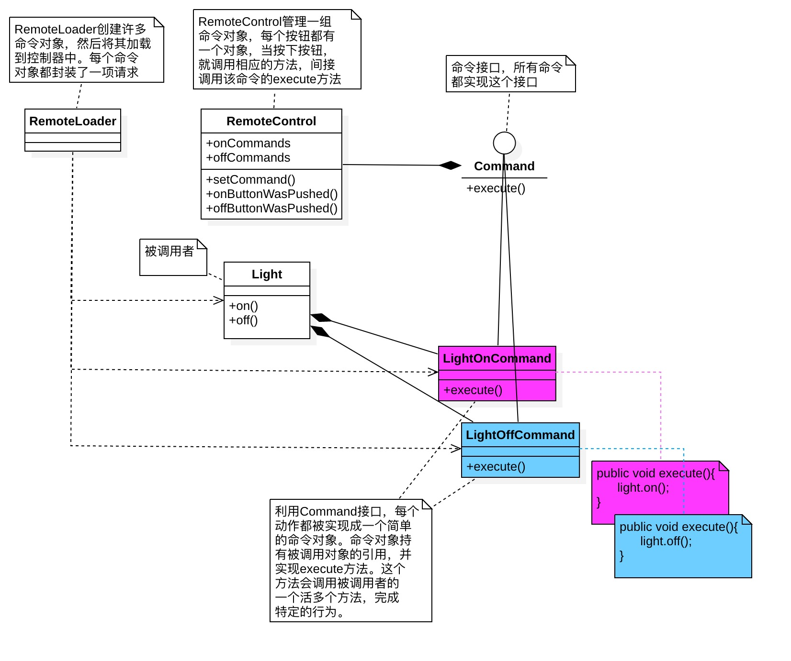

<h1 align="center">命令模式（Command）</h1>

## 定义：
将“请求”封装成对象，以便使用不同的请求、队列或者日志参数化其他对象。命令模式支持可撤销的操作。

## UML图

## 优点:
- 降低系统的耦合度。
- 新的命令可以容易的加入到系统中。
- 可以比较容易的设计一个命令队列和宏命令（组合命令）。
- 可以方便的实现对请求的Undo和Redo。

## 缺点:
- 使用命令模式可能会导致某些系统有过多的具体命令类。因为针对每个命令需要设计一个具体命令类，因此某些系统可能需要大量具体命令类，这将影响命令模式的使用。

## 适用环境：
- 系统需要将请求调用者和请求接收者解耦，使得调用者和接收者不直接交互。
- 系统需要再不同的时间指定请求，将请求排队和执行请求。
- 系统需要支持命令的撤销（Undo）操作盒恢复（Redo）操作。
- 系统需要将一组操作组合在一起，即支持宏命令。