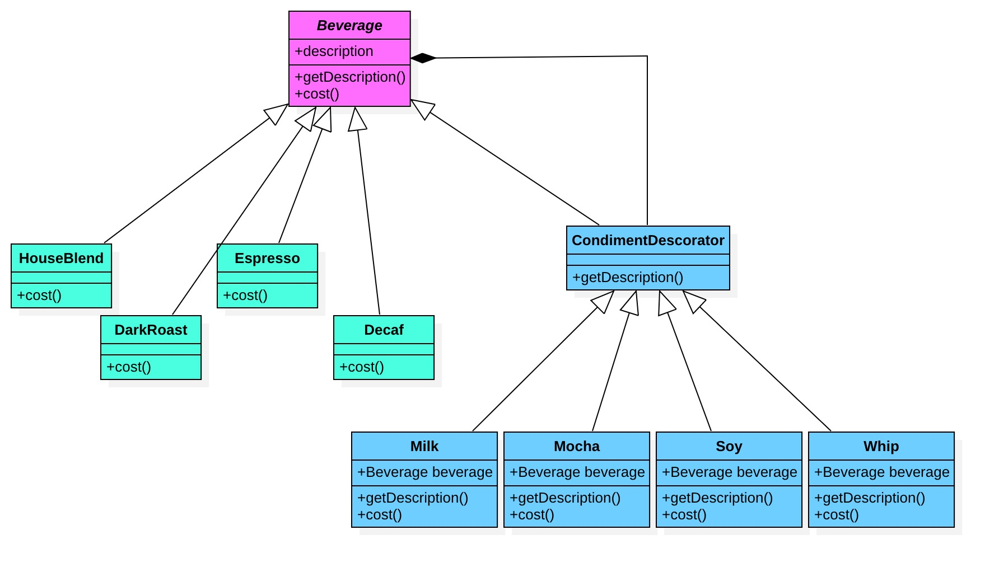

<h1 align="center">装饰者模式（Decorator）</h1>

## 定义：
动态的将责任附加到对象上。若要扩展功能，装饰者提供了比继承更有弹性的替代方案。

## 类图

## 四要素：
- Component：抽象构件
- ConcreteComponent：具体的组件
- Decorator：抽象装饰者，接口与Component具有相同的接口
- ConcreteDecorator：具体装饰者或者被装饰者

## 优点:
- 装饰者模式与继承关系的目的都是要扩展对象的功能，但是装饰者模式可以提供比继承更多的灵活性。
- 可以通过一种动态的方式来扩展一个对象的功能，通过配置文件可以在运行时选择不同的装饰器，从而实现不同的行为。
- 通过使用不同的具体装饰类以及这些装饰类的排列组合，可以创造出很多不同行为的组合。可以使用很多具体装饰来装饰同一对象，得到功能更为强大的对象。
- 具体构件类与具体装饰类可以独立变化，用户可以根据需要增加新的具体构件类和具体装饰类，在使用时再对其进行组合，原有代码无须改变，符合“开闭原则”

## 缺点:
- 使用装饰者模式进行系统设计时将产生很多小对象，这些对象的区别在于它们之间相互连接的方式有所不同，而不是它们的类或者属性值有所不同，同时还将产生很多具体装饰类。这些装饰类和小对象的产生将增加系统的复杂度，加大学习与理解的难度。
- 这种比继承更加灵活机动的特性，也同时意味着装饰模式比继承更加易于出错，排错也很困难，对于多次装饰对象，调试时寻找错误可能需要逐级排查，较为繁琐。

## 适用环境：
- 在不影响其他对象的情况下，以动态、透明的方式给单个对象添加职责。
- 需要动态的给一个对象增加功能，这些功能也可以动态的被撤销。
- 当不能采用继承的方式对系统进行扩充或者采用继承不利于系统扩展和维护时。不能采用继承的情况主要有两类：第一类是系统存在大量独立的扩展，为支持每一种组合将产生大量的子类，使得子类数据呈爆炸性增长；第二类是因为类定义不能继承（如final类）